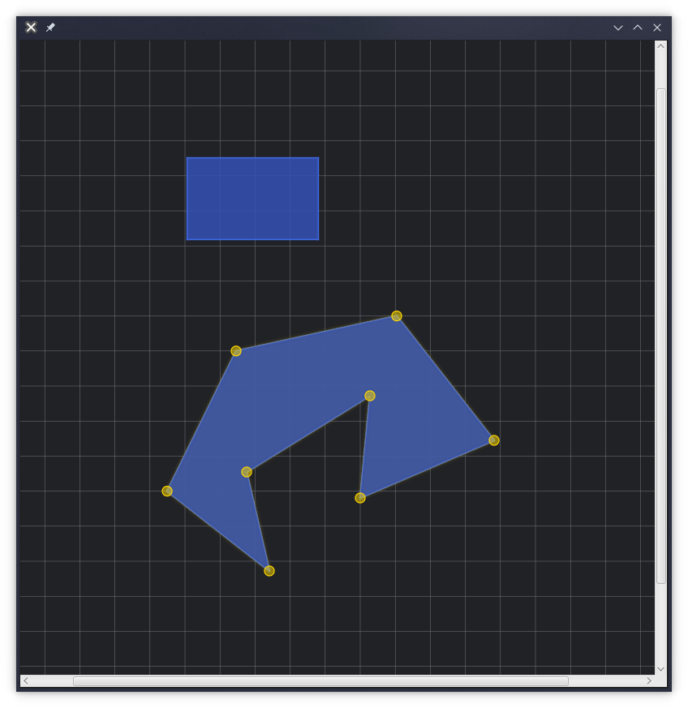

# jfx-ShapeEngine - Example

<p align="center">
  
</p>
      switch (evt.getCode()) {
        case R:
          engine.createInteractiveRectangle();
          break;
        case P:
          engine.createInteractivePolygon();
          break;
        case M:
          engine.toggleMagnetism();
          break;
        case G:
          gridState = !gridState;
          engine.activateGrid(gridState);
          break;
        default :
          break;

In this example there is differents shortcut to discover Engine's features:

ShortCut | Action
------------ | -------------
R | Draw rectangle
P | Draw polygon
M | Activate / Disable grid
G | Activate / Disable grid

## Run project

Ensure to have java JRE, JRE and JFX in your path.  
First, compile jfx-ShapeEngine library:

```bash
cd ../ && gradle build && -
```

Then run the example:

```bash
gradle run
```